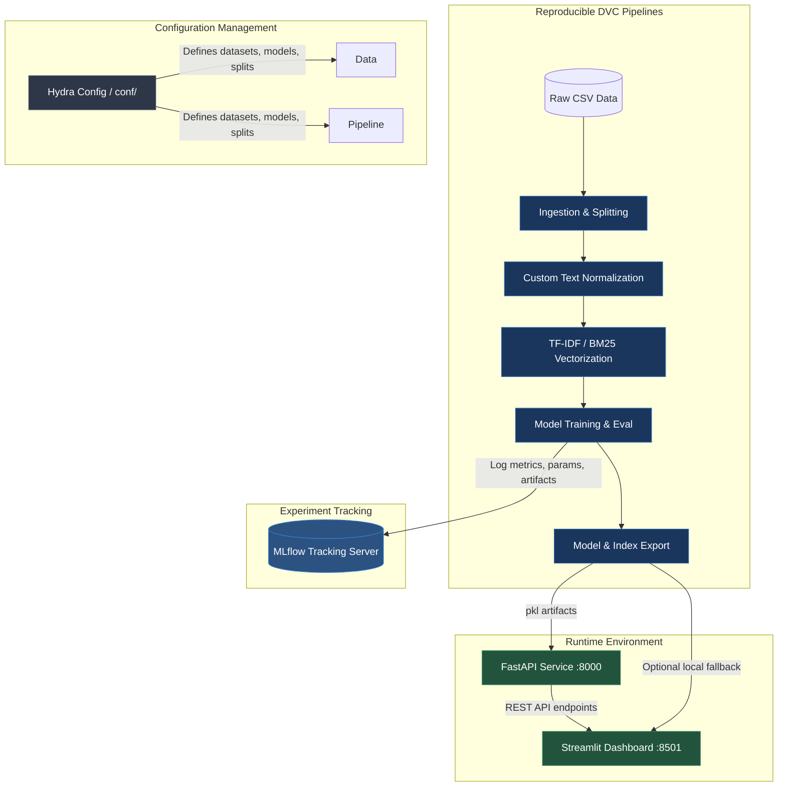

# 🧠 NLP Sentiment Intelligence & Semantic Search Platform

[](https://www.python.org/)
[](https://github.com/astral-sh/uv)
[](https://dvc.org)
[](https://mlflow.org)
[](https://fastapi.tiangolo.com)
[](https://streamlit.io)
[](https://www.docker.com/)

An end-to-end, production-grade Natural Language Processing (NLP) workspace that integrates **real-time sentiment classification**, a **high-performance BM25 semantic search engine**, and a **Word2Vec word embeddings explorer**. 

This system is built using modern MLOPs best practices, featuring hierarchical configuration management, automated data pipelines, experiment tracking, API deployment, and an interactive frontend dashboard.

---

## 🏗️ System Architecture



---

## ✨ Key Features

*   **Multi-Dataset Training Support**: Fully configured for **Amazon Fine Food Reviews** (product feedback) and **Sentiment140** (Twitter microblogging).
*   **Custom Text Normalization Pipeline**: Handles HTML stripping, lowercase formatting, stopword removal, social tokens, contraction expansion, and lemmatization/stemming.
*   **Hybrid Models**: Integrates multiple classical and ensemble models (`LogisticRegression`, `RandomForest`, `XGBoost`).
*   **BM25 Semantic Search**: Indexes the corpus and enables fast retrieval with optional sentiment-specific overrides.
*   **Dense Word Embeddings**: Visualizes dense relationships using custom-trained Word2Vec models.
*   **MLflow Integration**: Tracks hyper-parameters, classification metrics (Accuracy, F1, Precision, Recall), and serializes models automatically.
*   **DVC Pipelines**: Version control for datasets, pipelines, and artifacts. Completely reproducible steps via `dvc.yaml`.
*   **Dockerized Deployment**: Single-command startup spins up the MLflow server, FastAPI backend, and Streamlit dashboard together.

---

## 📂 Project Organization

```
├── .dvc/                  <- Data Version Control configurations
├── conf/                  <- Hierarchical Hydra configuration templates
│   ├── dataset/           <- Dataset definitions (Amazon, Sentiment140)
│   ├── model/             <- Model hyper-parameters (Logistic Regression, RF, XGBoost)
│   ├── preprocess/        <- Custom text normalization pipelines
│   ├── split/             <- Train-test splitting parameters
│   └── vectorizer/        <- Vectorizer setups (TF-IDF, BoW, BM25)
├── data/
│   ├── raw/               <- Immutable raw datasets (CSV files)
│   └── processed/         <- Canonical data dumps used in modeling
├── docker-compose.yml     <- Configures FastAPI, Streamlit, and MLflow services
├── Dockerfile             <- Docker definition for the Python environment
├── dvc.yaml               <- DVC pipeline execution stages
├── Makefile               <- Developer automation commands (sync, format, lint)
├── models/                <- Serialized model and search index pickle files
├── notebooks/             <- Jupyter notebooks for data analysis & embedding exploration
├── pyproject.toml         <- UV project dependency management
├── src/
│   ├── api/               <- FastAPI backend code (endpoints & schemas)
│   ├── data/              <- Data ingestion & split utilities
│   ├── features/          <- Normalization, vectorization, & embedding code
│   ├── models/            <- Model training, evaluation, & prediction
│   ├── pipelines/         <- End-to-end training and indexing pipelines
│   ├── search/            <- BM25 query indexing and searching engine
│   └── streamlit_app.py   <- Interactive Streamlit dashboard
└── uv.lock                <- Lockfile for reliable environments
```

---

## 🚀 Getting Started

### 1. Prerequisites
Ensure you have the following installed on your machine:
*   [Python 3.12+](https://www.python.org/)
*   [uv](https://github.com/astral-sh/uv) (Highly recommended package manager)
*   [Docker & Docker Compose](https://www.docker.com/)

### 2. Installation & Setup
Clone the repository and install all dependencies using `uv`:
```bash
# Clone the repository
git clone <repository-url>
cd NLP-Sentiment-Analysis

# Initialize and sync the virtual environment
uv sync
```

Activate the virtual environment:
*   **Windows**: `.venv\Scripts\activate`
*   **macOS / Linux**: `source .venv/bin/activate`

Copy the `.env.example` file to `.env` and set up any required API credentials (e.g., if using remote MLflow backends):
```bash
cp .env.example .env
```

### 3. Placing Raw Data
Place your raw datasets inside the `data/raw/` directory:
- Amazon Reviews: `data/raw/Reviews.csv`
- Sentiment140: `data/raw/training.1600000.processed.noemoticon.csv`

---

## ⛓️ Pipeline & Experiment Tracking

The workflows are managed via DVC. You can run all pipelines using:

```bash
uv run dvc repro
```

To run training for specific datasets or modify vectorizer configurations via CLI (utilizing Hydra overrides):

```bash
# Train the Amazon dataset with Logistic Regression and TF-IDF
uv run python src/pipelines/train_pipeline.py dataset=amazon model=logistic_regression vectorizer=tfidf

# Train the Sentiment140 dataset with BM25 vectorizer
uv run python src/pipelines/train_pipeline.py dataset=sentiment140 vectorizer=bm25

# Build the semantic search index for Amazon Reviews
uv run python src/pipelines/search_pipeline.py dataset=amazon
```

All hyper-parameters and validation results are logged to the MLflow local tracking server automatically.

---

## 🐳 Application Execution & Deployment

### Method A: Docker Compose (Recommended)
Build and run the entire ecosystem (FastAPI, Streamlit, and MLflow) with one command:
```bash
docker compose up --build
```

Access the services:
*   **FastAPI Backend API Docs**: [http://localhost:8000/docs](http://localhost:8000/docs)
*   **Interactive Streamlit Dashboard**: [http://localhost:8501](http://localhost:8501)
*   **MLflow Tracking Dashboard**: [http://localhost:5000](http://localhost:5000)

### Method B: Manual Execution
If you prefer running services directly on your host machine:

1.  **Launch the MLflow server**:
    ```bash
    uv run mlflow server --host 127.0.0.1 --port 5000 --backend-store-uri sqlite:///mlruns/mlflow.db --default-artifact-root /mlruns/artifacts
    ```
2.  **Run the FastAPI app**:
    ```bash
    # Set target dataset env variable ('amazon' or 'sentiment140')
    $env:DATASET="amazon"
    uv run uvicorn src.api.app:app --host 127.0.0.1 --port 8000
    ```
3.  **Run the Streamlit Dashboard**:
    ```bash
    $env:DATASET="amazon"
    uv run streamlit run src/streamlit_app.py --server.port=8501
    ```

---

## 🔌 API Documentation

The FastAPI backend exposes endpoints for high-throughput sentiment classification and low-latency document searching.

### `GET /health`
Verifies that the services are healthy and model artifacts are loaded.
*   **Response**:
    ```json
    {
      "status": "ok",
      "dataset": "amazon",
      "search_index_loaded": true
    }
    ```

### `POST /predict`
Predicts the sentiment of the input text.
*   **Request Body**:
    ```json
    {
      "text": "The food was fresh and the customer service was fantastic!"
    }
    ```
*   **Response**:
    ```json
    {
      "label": 1,
      "sentiment": "positive",
      "confidence": 0.9841
    }
    ```

### `POST /search`
Retrieves documents matching the search terms from the indexed corpus.
*   **Request Body**:
    ```json
    {
      "query": "delicious cookies",
      "n": 3,
      "sentiment_filter": 1
    }
    ```
*   **Response**:
    ```json
    {
      "query": "delicious cookies",
      "results": [
        {
          "document": "These chocolate chip cookies are absolutely delicious, highly recommend!",
          "index": 1284,
          "score": 4.1205,
          "label": 1
        }
      ],
      "total": 1
    }
    ```

---

## 📊 Streamlit UI Walkthrough

The interface is structured into three dedicated views:

1.  **🎯 Sentiment Classification**: An interactive playground where users can input raw sentences to analyze their positive/negative classification thresholds.
2.  **🔍 Semantic Search Engine**: Demonstrates the capabilities of the BM25 index, retrieving matching corpus rows with interactive score sliders and sentiment filtering.
3.  **📊 Word Embeddings Explorer**: Highlights relationships mapped from custom-trained Word2Vec models. Users search for a seed word (e.g. `delicious`) to display top semantic associations and similarity cosine curves.

---

## 🛠️ Formatting & Development Guidelines

Ensure all code follows the styling formatting guidelines. Before pushing code, run formatting and checks:

```bash
# Format codebase with black & isort
make format

# Run linter checks (black, isort, flake8)
make lint
```
